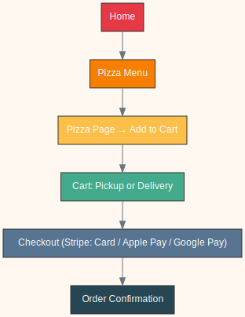

# 🍕 O’Frero Pizza – Project README

## 0. Team Formation (mandatory)
- **Initial Meeting**: Team members introduced themselves, shared backgrounds, strengths, and interests.
- **Roles Assigned**: A temporary **Project Manager** was nominated to coordinate the first stage.
- **Team Norms**:
  - Communication via **Discord**.
  - Task management with **GitHub Projects**.
  - Weekly sync meeting every Monday.

---

## 1. Research and Brainstorming (mandatory)
- **Individual Research**: Each member explored e-commerce trends, modern pizza websites, and payment system integrations.
- **Group Brainstorming**:
  - **Mind Mapping**: Explored ideas around food delivery, reservations, loyalty programs, and eco-friendly packaging.
  - **SCAMPER Framework**: Focused on innovating the pizza ordering experience (e.g., customizable pizzas, subscription models).
  - **“How Might We”** Questions: 
    - How might we simplify pizza ordering in 3 clicks?
    - How might we integrate multiple payment options seamlessly?
    - How might we make the site fresh, modern, and mobile-friendly?

---

## 2. Idea Evaluation (mandatory)
- **Criteria Defined**:
  - Feasibility for a beginner developer.
  - Potential impact for customers (ease of use, accessibility).
  - Technical alignment with modern frameworks (Next.js, Tailwind, Stripe).
  - Scalability for future SaaS model.
- **Scoring Rubric**: Rated ideas from 1–5 across feasibility, impact, and scalability.
- **Risks Identified**:
  - Payment integration complexity (Stripe, PayPal).
  - Managing delivery logistics and zones.
  - Time management for project deadline.

---

## 3. Decision and Refinement (mandatory)
- **Final MVP Selected**: Modern responsive pizza ordering website (**O’Frero Pizza**).
- **Problem Solved**: Current pizza ordering processes can be slow, outdated, or lack modern payment options.
- **Target Audience**: Local customers looking for take-out or delivery, preferring mobile-first experiences.
- **Key Features**:
  - Menu browsing by categories.
  - Add pizzas to cart with sizes/options.
  - Checkout with **Stripe (Card, Apple Pay, Google Pay)** and **PayPal**.
  - Order stored in database.
  - Basic admin panel to view orders.
- **Expected Outcome**: A functional MVP demonstrating a complete pizza ordering flow from homepage to payment confirmation.

---

## 4. Idea Development Documentation (mandatory)
- **Ideas Considered**:
  - **Reservation system**: Rejected (complexity vs MVP scope).
  - **Pizza subscription service**: Rejected (too ambitious for timeline).
  - **Eco-friendly packaging platform**: Interesting but not aligned with restaurant focus.
  - **Responsive pizza ordering site**: Selected (balanced feasibility and impact).
- **Selected MVP Summary**:
  - **Rationale**: Achievable within timeframe, aligned with industry needs, and supports optional future enhancements (admin, delivery tracking, coupons, PWA).
  - **Potential Impact**: Smooth ordering experience improves customer satisfaction and loyalty.
- **Team Overview**:
  - Formed a collaborative group with clear communication norms.
  - Followed structured brainstorming and evaluation steps.

---

## 📊 User Journey MVP

### Steps
1. **Home** → landing page introducing O’Frero Pizza.
2. **Pizza Menu** → browse pizzas by categories.
3. **Pizza Page** → select size/options and add to cart.
4. **Cart** → choose Pickup or Delivery.
5. **Checkout** → pay via Stripe (Card, Apple Pay, Google Pay) or PayPal.
6. **Order Confirmation** → see order details and success message.